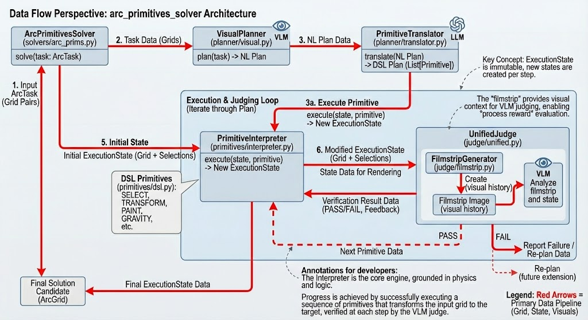

# Primitives-Based ARC-AGI-2 Solver

A novel ARC-AGI-2 solver using **generic primitives** with **step-by-step verification** and **learning feedback loop**.

## Features

- **Visual Planning**: VLM analyzes grid images to generate transformation plans
- **8 Core Primitives**: SELECT, TRANSFORM, PAINT, FILTER, COMPOSITE, COPY, EXTRACT, GRAVITY
- **Step-by-Step Verification**: VLM validates each primitive execution
- **Learning Loop**: Failed steps are fed back to improve subsequent attempts
- **Model Presets**: fast/balanced/quality configurations

## Quick Start

```bash
# Activate the shared venv
source ../arc_solver/.venv/bin/activate
cd arc_primitives_solver

# Basic run with visual planning
python run.py --task-id 00d62c1b --preset fast --visual-planning

# Multiple attempts with learning loop
python run.py --task-id 00d62c1b --preset quality --visual-planning --attempts 3

# Without VLM (faster, no verification)
python run.py --task-id 00d62c1b --preset fast --attempts 1
```

## Example Run

```
$ python run.py --task-id 00d62c1b --preset fast --visual-planning --attempts 1

2026-01-16 17:24:16 [INFO] Primitives-based ARC Solver
2026-01-16 17:24:16 [INFO] Task: 00d62c1b (training)
2026-01-16 17:24:16 [INFO] Model preset: fast
2026-01-16 17:24:16 [INFO] Visual planning enabled

Attempt 1/1
  Step 1: Generating plan... (VLM with grid images)
  Step 2: Translating to primitives...
  Step 3: Executing with verification...
    Executing step 1/5: SELECT connected components...
    Executing step 2/5: SELECT the largest object...
    Executing step 3/5: PAINT selected cells with yellow...
    Executing step 4/5: REPLACE yellow with green...
    Executing step 5/5: PAINT with yellow...
  Filmstrip saved to: logs/filmstrips/filmstrip_6_steps.png

Best candidate solution:
00000000000004444400
00000000000004000400
...
```

## Architecture



**Data Flow:**
1. Input ARC task → VisualPlanner (VLM) → Natural language plan
2. PrimitiveTranslator (LLM) → DSL primitives
3. PrimitiveInterpreter → ExecutionState changes
4. UnifiedJudge + FilmstripGenerator → VLM verification
5. Pass/Fail → Learning loop or final output

## Model Presets

| Preset | Text Model | VLM | Speed |
|--------|------------|-----|-------|
| `fast` | Nemotron-30B | Qwen2.5-VL-32B | Fastest |
| `balanced` | Kimi-K2 | InternVL3-78B | Medium |
| `quality` | DeepSeek-V3.2 | Qwen3-VL-235B | Best |

## Core Primitives

| Primitive | Purpose | Example |
|-----------|---------|---------|
| `SELECT` | Find objects | "SELECT all green cells" |
| `TRANSFORM` | Geometry | "ROTATE 90 degrees" |
| `PAINT` | Colors | "PAINT with yellow" |
| `FILTER` | Refine | "FILTER keep only border" |
| `COMPOSITE` | Combine | "OVERLAY on background" |
| `COPY` | Duplicate | "COPY selection" |
| `EXTRACT` | Crop | "EXTRACT bounding box" |
| `GRAVITY` | Drop | "GRAVITY down" |

## Project Structure

```
arc_primitives_solver/
├── arc_prims/
│   ├── primitives/
│   │   ├── dsl.py          # Primitive definitions
│   │   └── interpreter.py  # Execution engine
│   ├── judge/
│   │   ├── unified.py      # VLM verification
│   │   └── filmstrip.py    # Visual trajectory
│   ├── planner/
│   │   ├── visual.py       # VLM planning (grid images)
│   │   ├── english.py      # Text planning
│   │   └── translator.py   # English → primitives
│   ├── solver.py           # Main pipeline + learning loop
│   └── config.py           # Model presets
├── run.py                  # CLI entry point
└── logs/filmstrips/        # Execution visualizations
```

## Requirements

- Python 3.10+
- Chutes API key in `.env` file
- Uses `arc_solver/.venv` (shared virtual environment)

## License

MIT
